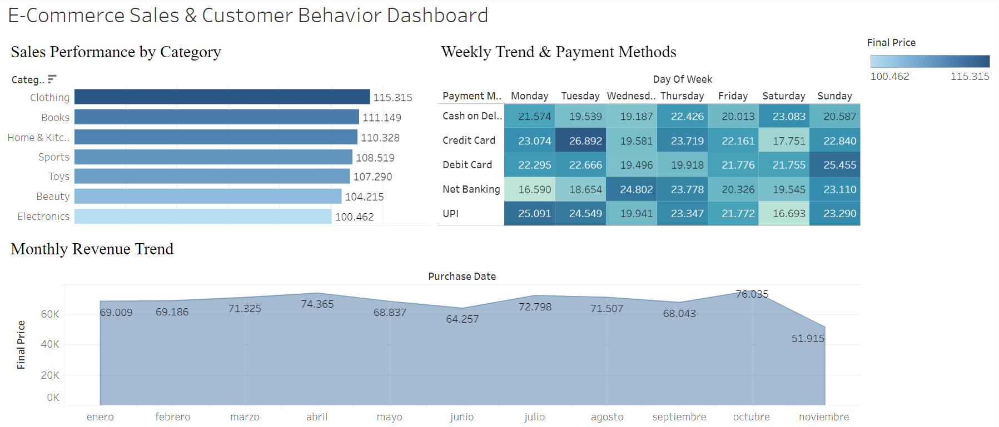

# E-Commerce Transactions & Customer Behavior Analysis

A comprehensive data analytics project featuring end-to-end database pipeline construction, advanced SQL querying, and an interactive Tableau dashboard to analyze sales performance, transaction trends, and payment preferences.

---

## 📊 Interactive Dashboard
[**👉 View the Interactive Tableau Dashboard Here**](https://public.tableau.com/views/E-Commerce_Sales_Dashboard_17841712359720/E-CommerceSalesCustomerBehaviorDashboard?:language=es-ES&:sid=&:redirect=auth&:display_count=n&:origin=viz_share_link)



---

## 📌 Project Overview
This project simulates the workflow of a Data Analyst inside a global e-commerce retail platform. The goal was to transform raw, unstructured transaction data into actionable business intelligence by:
1. **Cleaning and Transforming Raw Data** using Python and SQL to handle missing values and correct data types.
2. **Modeling and Querying a Relational Database** in PostgreSQL to answer critical business questions.
3. **Designing a High-Impact BI Dashboard** in Tableau to monitor key performance indicators (KPIs), analyze weekly purchasing patterns, and visualize revenue trajectory.

---

## 🛠️ Tech Stack & Tools
* **Database Management:** PostgreSQL, DBeaver
* **Data Visualization:** Tableau Desktop / Tableau Public
* **Data Modeling & SQL Queries:** Advanced JOINs, CTEs, Aggregations, Window Functions
* **Languages:** SQL, Markdown

---

## 🗄️ Database Schema & Data Modeling
The cleaned e-commerce transaction dataset was structured into a highly efficient relational schema in PostgreSQL to support rapid analytical querying:

```sql
CREATE TABLE ecommerce_transactions_cleaned (
    transaction_id VARCHAR(50) PRIMARY KEY,
    customer_id VARCHAR(50),
    purchase_date TIMESTAMP,
    product_category VARCHAR(50),
    product_brand VARCHAR(50),
    product_price NUMERIC(10, 2),
    quantity INT,
    total_amount NUMERIC(10, 2),
    payment_method VARCHAR(50),
    customer_age INT,
    customer_gender VARCHAR(10),
    day_of_week VARCHAR(15),
    month_name VARCHAR(15),
    final_price NUMERIC(10, 2)
);
```

---

## 💻 SQL Portfolio: Business Insights & Queries
Below are some of the key analytical questions solved using PostgreSQL during the exploration phase of this project.

### 1. Monthly Revenue Trajectory
* **Objective:** Track gross sales progress month-over-month to identify seasonal peaks.
```sql
SELECT 
    month_name,
    SUM(final_price) AS total_revenue,
    COUNT(transaction_id) AS total_orders
FROM ecommerce_transactions_cleaned
GROUP BY month_name, EXTRACT(MONTH FROM purchase_date)
ORDER BY EXTRACT(MONTH FROM purchase_date);
```

### 2. High-Value Product Categories
* **Objective:** Determine which categories generate the highest percentage of total platform income.
```sql
SELECT 
    product_category,
    SUM(final_price) AS category_revenue,
    ROUND((SUM(final_price) / (SELECT SUM(final_price) FROM ecommerce_transactions_cleaned) * 100), 2) AS revenue_share_percentage
FROM ecommerce_transactions_cleaned
GROUP BY product_category
ORDER BY category_revenue DESC;
```

### 3. Payment Preferences by Day of the Week
* **Objective:** Identify if customer payment methods shift during weekends vs. weekdays.
```sql
SELECT 
    day_of_week,
    payment_method,
    COUNT(transaction_id) AS transaction_count,
    SUM(final_price) AS total_sales
FROM ecommerce_transactions_cleaned
GROUP BY day_of_week, payment_method
ORDER BY 
    CASE 
        WHEN day_of_week = 'Monday' THEN 1
        WHEN day_of_week = 'Tuesday' THEN 2
        WHEN day_of_week = 'Wednesday' THEN 3
        WHEN day_of_week = 'Thursday' THEN 4
        WHEN day_of_week = 'Friday' THEN 5
        WHEN day_of_week = 'Saturday' THEN 6
        WHEN day_of_week = 'Sunday' THEN 7
    END, 
    total_sales DESC;
```

---

## 🎨 Tableau Dashboard Architecture
The dashboard was built to enable business leaders to intuitively filter the entire dataset on demand. It is divided into three major functional areas:

1. **Sales Performance by Category (Bar Chart):** Displays the ranking of different departments based on sales. Acting as a master filter, clicking on any category instantly filters the rest of the dashboard.
2. **Weekly Trend & Payment Methods (Heatmap):** Uses a grid structure starting on **Monday** (following ISO 8601 e-commerce standard representation) to cross-reference payment methods and weekdays. Darker blue cells indicate high-concentration transaction slots (e.g., Credit Cards on Tuesdays).
3. **Monthly Revenue Trend (Area Chart):** Highlights the overall financial health and trajectory throughout the year, displaying a steady rise peaking in October.

---

## 📈 Key Insights & Business Recommendations
* **Strategic Credit Campaigns:** Transactions via **Credit Card** reach peak intensity on **Tuesdays** (generating over $26k). Implementing promotional partnerships or targeted cash-back offers on this specific day could boost credit volumes further.
* **Peak Season Preparation:** Sales show a highly consistent upward trend starting in July and peaking in October ($76,035). Marketing budgets and logistics capabilities should be heavily prioritized and scaled up during Q3 to capitalize on this peak.
* **Category Focus:** **Clothing** is the leading category on the platform ($115k), closely followed by **Books** ($111k). These two categories combined represent the core driver of the platform's inventory velocity.
